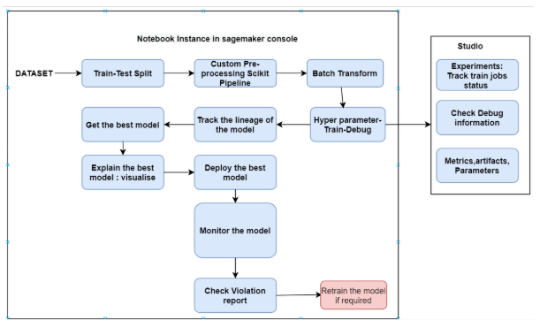
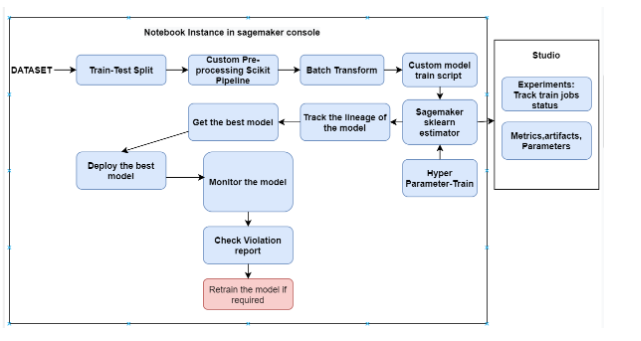
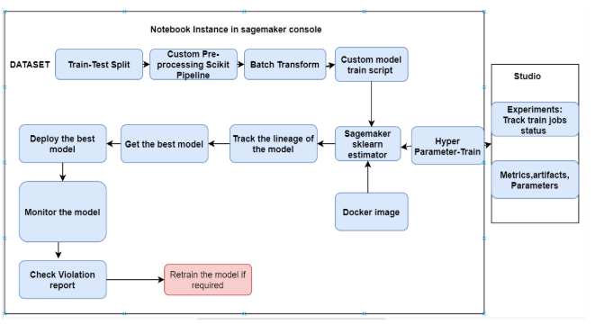
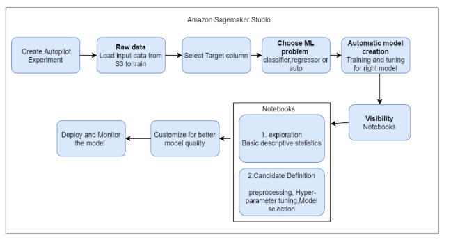

# AWS-sagemaker

Please find the below documentation link for creating Amazon sagemaker notebook instance.
link: https://drive.google.com/file/d/1LX1VU2B01nvIrWRpdmFe8OETZTkopCd_/view?usp=sharing

## Project Location

To work with `aws-sagemaker` source code in development, install from GitHub:
```bash
  $ git clone https://github.com/tigerrepository/MLE-Playground.git
  $ cd MLE-Playground
  $ git checkout feat/aws-sagemaker
  $ cd aws-sagemaker
```
### Directory Structure
```html
. --------------------> (README.md) - Contains details about ******* Project-Structure *******, Developer-Instructions
├── Datasets
|     ├── input-datasets
|      
|── Notebooks
|     ├── train_test_split
|     ├── inbuilt-sagemaker-model
|     ├── monitoring
|     ├── custom_train_inference
|     ├── sagemaker-scikit-learn-container-master
|     ├── custom_docker_image_train_inference  
|     ├── autopilot
|── images
|
```
### Order of executions

#### Train-test split

Please find the folder train_test_split to split the dataset to train and test data.

input: 
```html
├── Datasets
|         └── housing_dataset.csv
|
```

scripts to run present in following dir: 

```html
├── Notebooks
|         └── train_test_split
|
```


#### Inbuilt-sagemaker-model
 
scripts to run present in following dir: 

```html
├── Notebooks
|       ├── inbuilt-sagemaker-model
|
```

Inbuilt sagemaker model flow:
         
   
   
#### Monitoring

scripts to run present in following dir: 

```html
├── Notebooks
|       ├── monitoring
|
```

#### Custom_train_inference

script to run present in following dir: 

```html
├── Notebooks
|       ├── custom_train_inference
|
```

Custom_train_inference workflow:



#### Custom_docker_image_train_inference

script to run present in following dir: 

```html
├── Notebooks
|       ├── sagemaker-scikit-learn-container-master
|                   └── Build_customized_image.txt
|       ├── custom_docker_image_train_inference
|
```

Custom_docker_image_train_inference workflow:




#### Sagemaker Autopilot

Results of automated approach (AutoML) present in following dir: 

```html
├── Notebooks
|       ├── autopilot
|
```
Sagemaker Autopilot workflow:



         
 
          
      
            
