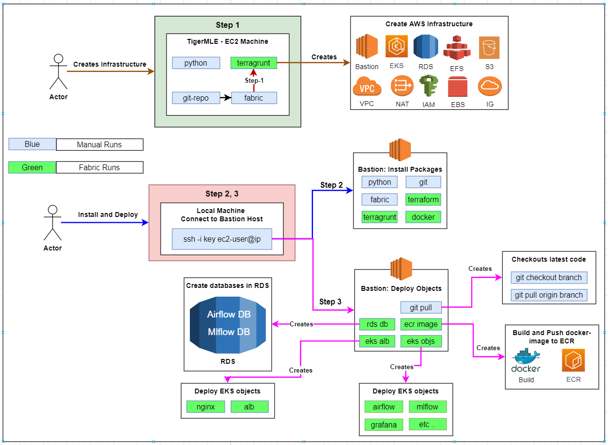

### Detailed deployment flow



### ---------------------------------------------------------------------------------------------

### 1. Tiger-MLE EC2-Machine, Manual Installations, `(One-Time-Setups)`

#### 1.1. Ensure python3, pip installed on your machine
```bash
    sudo yum update -y
    sudo yum install python37 -y
    sudo curl -O https://bootstrap.pypa.io/get-pip.py
    python3 get-pip.py --user
    
    python3 --version
    pip3 --version
```

#### 1.2. Install fabric
```bash
    pip install fabric==2.5.0
    
    fab --version
```

#### 1.5. Install git
```bash
    sudo yum update -y
    sudo yum install git -y
    
    git --version
```

#### 1.6. Clone `Git-Repo`
```bash
    git clone 'https://github.com/tigerrepository/Shipments_Forecasting.git'
```

#### 1.7. cd to `Shipments_Forecasting`
```bash
    cd Shipments_Forecasting
    git checkout master # Checkout to branch which has the latest code
```


### 1.8. Ensure the following variables has been set correctly in `terraform/fabfile.yml`
```yaml 
    local_bin_variable: /home/user-id/.local/bin <<For EC2 execution>>
    local_bin_variable: /home/ec2-user/.local/bin <<For Bastion-Host execution>>
```

#### 1.9. cd to Shipments_Forecasting/deploy directory
```bash
    cd deploy
```


#### 1.10. Install Terraform
```bash
    fab install-terraform-cli -f fabfile.yml
```

#### 1.11. Install Terragrunt
```bash
    fab install-terragrunt-cli -f fabfile.yml
```

#### ********** THIS SHOULD BE RUN ONLY ON TIGER-MLE-EC2 MACHINE **********
#### Make sure `aws access keys` are configured using `aws configure`, 
```bash
    Make sure,
        - AWS Access Key ID
        - AWS Secret Access Key
        - Region
    configured using `aws-configure`
```
#### 1.12. Create AWS resources, (ONLY on TIGER-MLE-EC2 MACHINE)
```bash
    fab terragrunt-deploy-cli -f fabfile.yml
```
*Incase of error, run it again with `fab terragrunt-deploy-cli -f fabfile.yml -w` and monitor the progress*


#### ********** THIS SHOULD BE RUN ONLY ON TIGER-MLE-EC2 MACHINE **********
#### 1.13. SSH into `bastion-host`
```bash
    ssh -i key.pem ec2-user@ip-address
```


### 1.14. Follow the above steps from `1.1` to `1.11` inside the ********BASTION HOST********

### ---------------------------------------------------------------------------------------------

### 2. Bastion-Host: Docker, ECR image setups

#### Ensure the following variables has been set correctly in `terraform/fabfile.yml`
```yaml 
    docker_image_id:
```

#### 2.1. cd to Shipments_Forecasting/deploy directory
```bash
    cd Shipments_Forecasting/deploy
```

#### 2.2. Install Docker on bastion-host
```bash
    fab install-docker-cli -f fabfile.yml
```

#### 2.3. Build & ECR docker image
```bash
    fab ecr-docker-deploy-cli -f fabfile.yml
```

### ---------------------------------------------------------------------------------------------

### 3. Bastion-Host, EKS resources deployments

### Ensure the following variables has been set correctly in `terraform/fabfile.yml`
```yaml 
    rds_db_id: <<get from AWS : RDS>>
    alb_endpoint: <<get from AWS : "EC2--->Load-Balancers" after running point 3.3>> 
    efs_id: <<get from AWS : EFS>>
    docker_image_id:
    project_root_folder:
    deploy_folder:
    mlflow_artifacts: <<Default value set, check yml>>
    airflow_dags: <<Default value set, check yml>>
    airflow_logs: <<Default value set, check yml>>
```

#### 3.1. cd to Shipments_Forecasting/deploy directory on your Local-Machine
```bash
    cd Shipments_Forecasting/deploy
```

#### 3.2. Create RDS databases on AWS
```bash
    fab rds-deploy-cli -f fabfile.yml
```

### 3.3. Install kubectl
```bash
    fab install-kubectl-cli -f fabfile.yml
```

#### 3.3. Create EKS ALB resources
```bash
    fab eks-alb-deploy-cli -f fabfile.yml
```

#### Note down the ALB DNS and paste in the fabfile.yml, <<alb_endpoint>>
```yaml 
    alb_endpoint: <<get from AWS : "EC2--->Load-Balancers" after running point 3.3>> 
```

#### 3.4. Create EKS resources
```bash
    fab eks-deploy-cli -f fabfile.yml
```

### 3.5. Change C5 nodes' desired=0 and t3 node's desired=2 and run this command
```bash
    fab eks-scale-nodes-cli -f fabfile.yml
```

### ---------------------------------------------------------------------------------------------

### Extras

### 1. Scale Nodes
```bash
    fab eks-scale-nodes-cli -f fabfile.yml
```

#### 2. Destroy EDA Dashboard
```bash
    fab eks-eda-dash-destroy-cli -f fabfile.yml
```

#### 3. Deploy EDA Dashboard
```bash
    fab eks-eda-dash-deploy-cli -f fabfile.yml
```

#### 4. Destroy EVAL Dashboard
```bash
    fab eks-eval-dash-destroy-cli -f fabfile.yml
```

#### 5. Deploy EVAL Dashboard
```bash
    fab eks-eval-dash-deploy-cli -f fabfile.yml
```

### ---------------------------------------------------------------------------------------------

<!-- COMMENTED for Safety Reasons
### Destroy,

#### 1. EKS resources
```bash
    fab eks-destroy-cli -f fabfile.yml
```

#### 2. EKS ALB resources
```bash
    fab eks-alb-destroy-cli -f fabfile.yml
```

#### 3. Destroy AWS resources
```bash
    fab terragrunt-destroy-cli -f fabfile.yml
```
*Incase of error run it again with `fab terragrunt-destroy-cli -f fabfile.yml -w`*

### ---------------------------------------------------------------------------------------------
-->